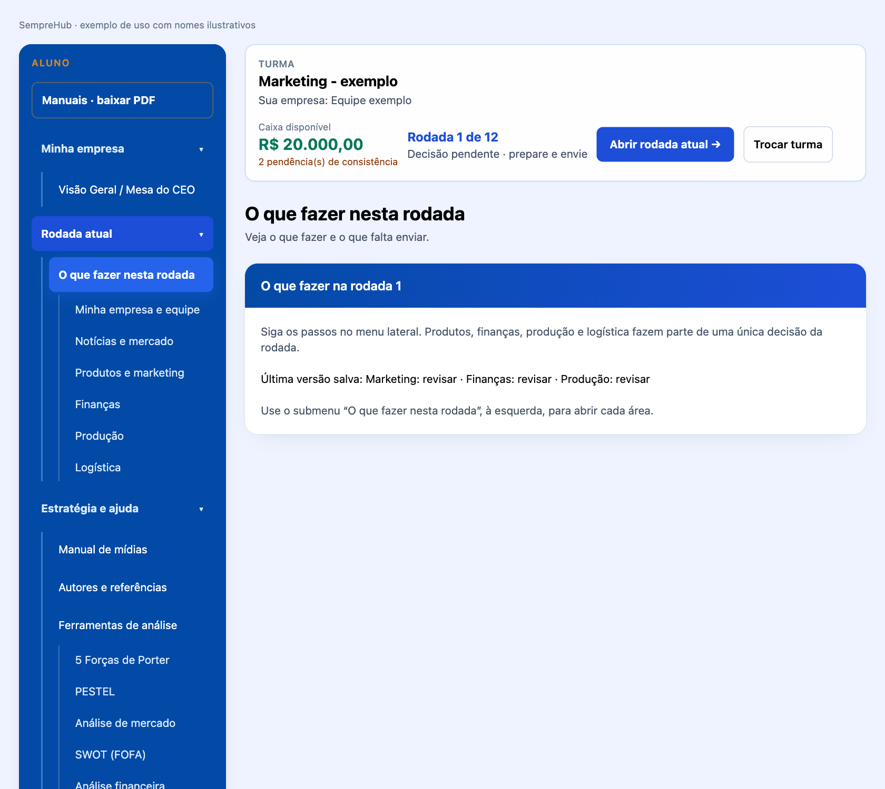
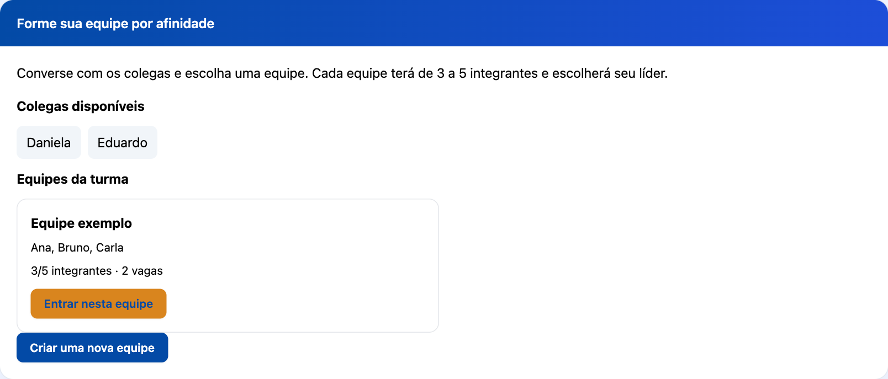
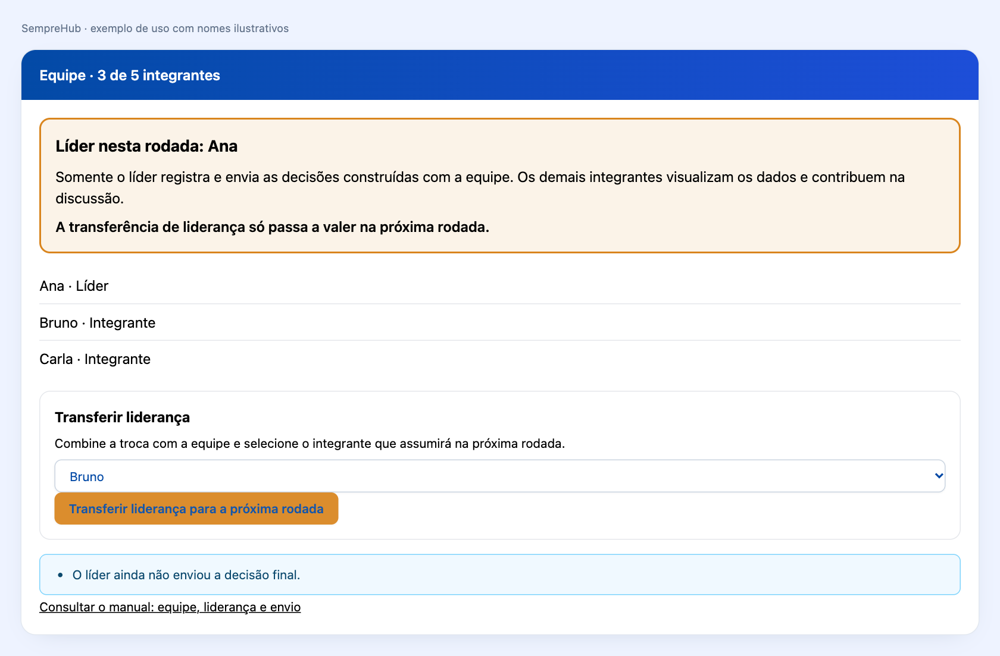
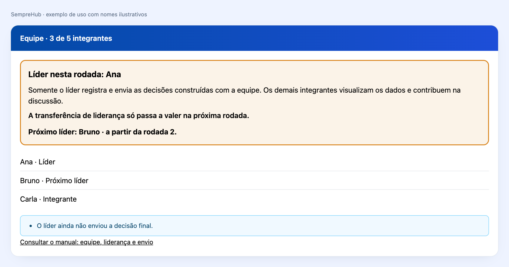
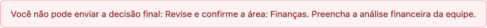
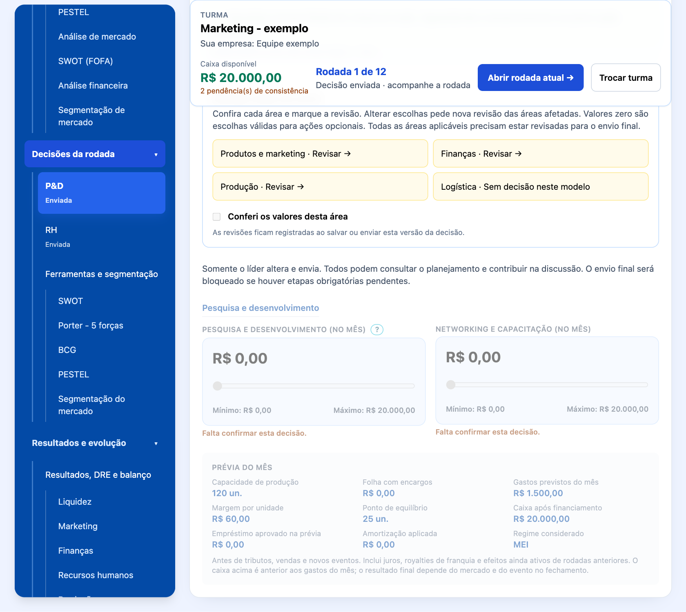
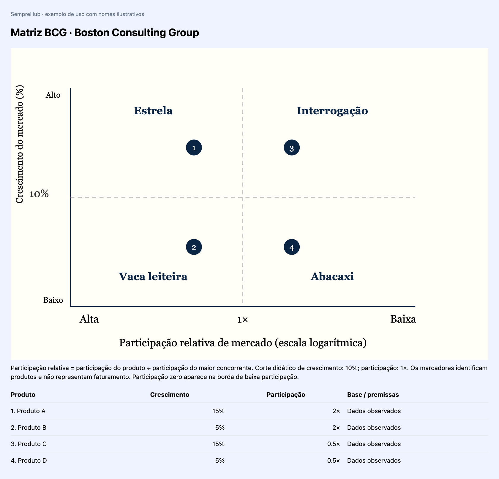

# SempreHub - Manual do aluno

## Carta do Fundador

Prezado(a) Futuro(a) Empreendedor(a) e Líder Educacional,

Seja muito bem-vindo(a) ao SempreHub.

Quando idealizei e criei este simulador, o meu objetivo não era construir apenas mais uma plataforma digital de negócios ou um repositório de planilhas contábeis tradicionais. Eu queria criar uma ponte viva entre o conhecimento teórico e a realidade do mercado — um espaço onde você pudesse experimentar a adrenalina, os desafios e as conquistas de liderar uma organização de verdade.

O nome SempreHub carrega a essência da metodologia que preparei para a sua jornada. O 'Sempre' representa a constância, a resiliência e o aprendizado contínuo (Lifelong Learning). O 'Hub' define esta plataforma como um centro conector. Olhando para a nossa logomarca, você verá uma rede de pontos interconectados: eles são os departamentos da sua empresa (Marketing, Produção, Logística, P&D, RH e Finanças). Nenhuma decisão sua será isolada; cada escolha impactará toda a organização.

Aqui, o erro não é um ponto final, mas sim uma variável de aprendizado. Se o seu caixa ficar no vermelho ou se uma estratégia de marketing não der o retorno esperado nesta rodada, não desanime. Analise os relatórios reais, observe o movimento dos seus concorrentes em sala de aula e reajuste a sua operação no mês seguinte.

O mercado do SempreHub está aberto e o futuro do ecossistema está inteiramente em suas mãos.

**Prof. Guandalini**

Criador e Fundador do SempreHub — Simulador de Empreendedorismo

## A história e o conceito da logomarca SempreHub

**Autoria e criação: Professor Guandalini.** O nome, a marca e a identidade visual do SempreHub foram idealizados e criados pelo Professor Guandalini. A marca aproxima o ambiente corporativo da conexão das redes modernas e representa uma metodologia de aprendizagem integrada, voltada ao Ensino Médio e Superior.

**SEMPRE** expressa constância, aprendizado contínuo e resiliência. Empreender é um ciclo de tentativas, análise de resultados, ajustes e evolução. **HUB** identifica um centro conector: estudantes, departamentos, gestão e mercado competitivo se encontram em um mesmo ecossistema.

### O símbolo: a rede de gestão

Os nós periféricos, em azul e ciano, representam os seis departamentos vitais: Pesquisa e Desenvolvimento (P&D), Produção, Logística, Marketing, Recursos Humanos (RH) e Finanças. Eles mostram uma empresa cujas áreas trabalham em conjunto.

As linhas conectoras representam a interdependência das decisões. Alterar o preço no Marketing pode mudar a demanda e o faturamento nas Finanças. Aumentar a Produção modifica a necessidade de materiais, de pessoas e de capacidade logística. Nenhuma decisão é isolada.

Os dois núcleos em Laranja Ouro representam a tomada de decisão do estudante e a resposta do mercado simulado. Sua posição central destaca que cada escolha encontra consequências na dinâmica da empresa e da concorrência.

### As cores e seu significado

**Azul Royal (#034AA6) e Azul Médio (#0762D9): rigor acadêmico.** Associam a identidade ao ambiente corporativo, à credibilidade e à seriedade pedagógica. A intenção visual é comunicar confiança e valorizar a aprendizagem empresarial.

**Ciano/Turquesa (#0AADBF): inovação e fluidez.** Relaciona a marca à tecnologia e à navegação intuitiva. Aproxima o universo da gestão de estudantes iniciantes e reforça uma experiência leve, organizada e acessível.

**Laranja Ouro (#D9851E): núcleo de decisão e geração de valor.** Destaca criatividade, iniciativa e competitividade. Na rede, orienta o olhar para os pontos centrais onde as decisões e suas consequências se conectam.

Na logomarca, os gradientes conectam as tonalidades azuis, cianas e douradas. O fundo branco valoriza o contraste da rede e do nome e organiza uma apresentação limpa para os conteúdos do manual.

### A tipografia: identidade corporativa acessível

A escrita sem serifas, com formas modernas e suaves, expressa democratização do conhecimento. O SempreHub foi concebido para estudantes de diferentes áreas, como Saúde, Humanas e Exatas. A organização visual ajuda a localizar decisões e compreender relações entre departamentos.

### Como ler a marca na prática

Ao observar a rede, lembre-se de verificar as consequências de cada escolha nas outras áreas. A marca traduz o propósito pedagógico do simulador: discutir, decidir, acompanhar resultados e aprender com os ajustes. Uma interpretação correta das ferramentas pode apoiar decisões melhores; resultados dependem das escolhas da equipe e do mercado simulado.

## Cockpit do estudante

Comece na **Visão Geral / Mesa do CEO**: confira nome da empresa, mês, caixa e pendências. No menu lateral, escolha um departamento; as decisões aparecem à direita.

1. **P&D:** defina o investimento em tecnologia e melhoria dos produtos.
2. **Produção:** planeje capacidade, fabricação, máquinas e manutenção.
3. **Logística:** escolha a modalidade de entrega nos modelos aplicáveis.
4. **Marketing:** planeje produtos, preços, campanhas e canais.
5. **RH:** decida contratações, demissões, horas extras e remuneração.
6. **Finanças:** avalie crédito, pagamentos e escreva a análise financeira da equipe.

Sliders mostram valores mínimos e máximos. Ações opcionais podem permanecer em zero. Confira o checklist; salve rascunhos enquanto estiver discutindo. Ao enviar, confirme no modal: depois do envio final, os valores ficam visíveis em **modo de leitura**, sem alterações até o próximo mês.

## Navegação: escolha à esquerda, trabalhe à direita

O menu lateral é o ponto de partida. Suas categorias e submenus aparecem abertos inicialmente. Você pode recolher uma categoria para organizar a tela e abri-la novamente quando precisar. O submenu selecionado fica destacado, e o conteúdo aparece no painel à direita. Em telas estreitas, o menu permanece disponível acima do conteúdo e possui rolagem própria.

1. Localize no menu o assunto desejado.
2. Clique uma vez no submenu. Não é necessário abrir outra janela para tomar decisões.
3. Confira o título do painel à direita antes de alterar qualquer valor.
4. Ao terminar, salve o rascunho, avance ou envie conforme a etapa.
5. Para estudar, abra **Manuais - baixar PDF**. Use **Visualizar** para consultar ou **Baixar PDF** para guardar uma cópia.

Os campos de decisão mostram pendências, como **Falta tomar esta decisão** ou **Falta confirmar esta decisão**. Eles não substituem este manual. A confirmação de uma área significa que a equipe conferiu todos os seus campos, incluindo a decisão de manter em zero ações opcionais. Um aviso de campo vazio continua pendente mesmo depois de marcar a revisão. Os estados do menu referem-se à última versão salva; valores ainda não salvos precisam ser registrados.

Versão 3.5 - outubro de 2026

Aprenda a interpretar o mercado, discutir decisões e observar suas consequências. Cada rodada representa um mês. As imagens mostram as telas do programa com nomes e situações ilustrativos.

## 1. Entre na turma indicada pelo professor

1. Crie sua conta de aluno e entre no SempreHub.
2. Na tela inicial, consulte **Turmas disponíveis**.
3. Clique no **nome da turma** indicado pelo professor. O nome é livre: não existe formato obrigatório nem significado automático.
4. Depois do ingresso, seu vínculo fica registrado nessa turma. Você não pode entrar em outra sem autorização do professor.

O professor pode deixar apenas uma turma disponível ou ocultar outras. Ocultar o ingresso não retira o acesso dos alunos já vinculados. Se nenhuma turma aparecer, procure o professor; não crie outra conta para contornar a matrícula.

## 2. Forme uma equipe por afinidade

Na sua turma, consulte **Colegas disponíveis** e **Equipes da turma**. Converse com os colegas para decidir com quem trabalhar. Uma equipe tem **no mínimo 3 e no máximo 5 integrantes**.

1. Para participar de uma equipe com vaga, clique em **Entrar nesta equipe**.
2. Para começar um grupo, clique em **Criar uma nova equipe** e informe o nome da empresa, seu perfil empreendedor e o regime inicial.
3. Os colegas entram na mesma equipe pela própria conta. Não é necessário compartilhar senha ou convite.
4. Criar a empresa não torna você automaticamente o líder.

O professor perguntará em sala se todos conseguiram entrar. Depois dessa conferência, ele poderá acionar a distribuição aleatória dos alunos cadastrados que ainda estejam sem equipe. O programa usa apenas vagas em equipes que já tenham pelo menos três integrantes e respeita o máximo de cinco. Se faltarem vagas, a distribuição não ocorre parcialmente: a turma precisa se organizar com o professor.

O professor não precisa informar a quantidade de alunos. Inclusões manuais são exceções para resolver impedimentos e ficam registradas com justificativa.

## 3. Escolha o líder e entenda as responsabilidades

Com três a cinco integrantes, abra **Minha empresa e equipe**. Cada aluno seleciona um integrante e clica em **Registrar minha escolha**. O candidato que receber mais da metade das escolhas da equipe será o líder inicial. Conversem antes de registrar as escolhas.

**Somente o líder registra, altera, salva e envia as decisões da empresa.** Os outros integrantes têm acesso de visualização aos diagnósticos, planejamento, resultados e histórico. Todos participam da discussão; não é necessária uma confirmação de envio por cada aluno.

O quadro da equipe destaca o líder atual e a regra de transferência. A equipe combina como organizar as responsabilidades de marketing, finanças, operações e pessoas. A liderança define quem envia, não quem pode contribuir.

### Como transferir a liderança

1. O líder atual abre **Minha empresa e equipe**.
2. Em **Transferir liderança**, seleciona outro integrante da própria equipe.
3. Clica em **Transferir liderança para a próxima rodada**.
4. Confere o aviso com o próximo líder e a rodada em que ele assumirá.

**A troca só vale na próxima rodada.** Durante a rodada atual, o líder anterior continua responsável por salvar e enviar. Depois que o professor fecha o mês, o programa efetiva a transferência e atualiza as permissões. Uma transferência programada não pode ser substituída por outra na mesma rodada. Na última rodada não existe uma próxima rodada para transferir.

Se o líder precisar trocar de turma, deve transferir a liderança e aguardar sua efetivação antes da autorização do professor. Registros anteriores de liderança e envio permanecem no histórico. Nas equipes que já existiam antes desta versão, o responsável anterior foi mantido como líder para preservar a continuidade.

## 4. Siga a sequência de decisões da rodada

Leia **Notícias e mercado** e discuta o cenário. Depois, percorra as áreas:

1. **Produtos e marketing:** preços, canais, campanhas, posicionamento e mix de cada produto.
2. **Ferramentas e segmentação:** SWOT, Porter, PESTEL, concorrência, diretriz, BCG e público-alvo.
3. **Finanças:** análise escrita da equipe, margens, custos, crédito, caixa e capital de giro.
4. **Produção:** produção, insumos, máquinas e capacidade.
5. **P&D e RH:** tecnologia, contratação, demissão, remuneração e capacitação.
6. **Logística:** frete e localização, quando disponíveis no modo Empresa tradicional.

O líder pode clicar em **Salvar rascunho** ou em **Salvar e ir para a próxima etapa**. O rascunho pode ficar incompleto e ainda não representa a entrega da rodada. Os colegas consultam a versão salva, então combine momentos para revisar juntos.

As áreas formam **uma única decisão da rodada**. O envio final registra o conjunto; avançar uma etapa não encerra a rodada. Depois de conferir uma área, marque **Conferi os valores desta área**. Alterar escolhas pede uma nova revisão das áreas afetadas.

### Trava de envio final

Clique em **Enviar decisão final** quando terminar. O programa confere as informações e bloqueia o envio se houver pendências. A mensagem informa o que precisa ser preenchido ou revisado.

Confira todas as áreas aplicáveis, os mixes dos produtos, a diretriz estratégica, a segmentação, a BCG e a análise financeira. Orçamentos de serviços de campanha também precisam estar completos quando exigidos. Se a turma avançar ou a versão mudar, atualize o painel antes de tentar salvar novamente.

**Comprar máquinas, contratar funcionários, pagar horas extras, solicitar empréstimos e investir em tecnologia são escolhas opcionais.** Zero é válido para essas ações e não impede o envio. A revisão obrigatória serve para confirmar que a equipe considerou a escolha.

Após o envio final, a decisão fica bloqueada em modo de leitura até o próximo mês. O prazo configurado pelo professor encerra automaticamente a rodada às 23:59:59 de Brasília. O professor também pode forçar o encerramento. Salve rascunhos enquanto a decisão ainda não estiver finalizada.

## 5. Interprete as ferramentas e compare os concorrentes

O programa disponibiliza **SWOT, Cinco Forças de Porter, PESTEL e análise de concorrência**. Os diagnósticos combinam informações atuais do mercado com os registros da empresa. Eles não escolhem a decisão da equipe.

Fatos confirmados, interpretações e **projeções** têm funções diferentes. Quando faltar informação, uma projeção apresenta a estimativa e as premissas usadas. Não trate uma projeção como resultado já ocorrido. O professor pode conferir os registros de pesquisa e acompanhar os diagnósticos de cada empresa e rodada.

- **SWOT:** interprete forças, fraquezas, oportunidades e ameaças; escolha a diretriz da equipe depois da leitura.
- **Porter:** avalie rivalidade, poder de fornecedores e compradores, novos entrantes e substitutos. Intensidades representam avaliações do cenário, não estatísticas oficiais.
- **PESTEL:** considere fatores políticos, econômicos, sociais, tecnológicos, ambientais e legais. Separe condições reais do setor das taxas e regras didáticas do simulador.
- **Concorrência:** compare perfil e localização, porte e participação, portfólio, qualidade e diferenciais, preços e pagamento, promoções e frete, canais, presença digital, atendimento e reputação. O programa apresenta uma tabela comparativa com as escolhas atuais da sua empresa.

Se não houver dados suficientes de um concorrente real, pode aparecer um **concorrente de referência projetado**, identificado como cenário de comparação. Dados internos, faturamento, participação ou reclamações não são tratados como fatos sem confirmação.

### Como a interpretação afeta a empresa

As consequências aparecem **por meio das escolhas da equipe**. Ignorar uma queda de demanda e produzir demais pode imobilizar dinheiro em estoque. Cobrar acima do limite do público escolhido pode reduzir vendas. Expandir com crédito caro pode comprometer o caixa. Entender oportunidades ajuda a ajustar preço, oferta, canais, capacidade e investimentos.

O programa confronta escolhas estruturadas de SWOT, BCG e segmentação com o mix. Incompatibilidades podem reduzir a conversão comercial, conforme os critérios mostrados na interface e nos resultados. Não existe garantia de lucro: concorrência, custos, capacidade e eventos também influenciam o desempenho. Textos livres não recebem descontos arbitrários.

**A segmentação e a análise financeira são responsabilidade dos alunos.** Definam o público, os canais, a localização, a cobertura e o preço máximo aceito. Em Finanças, escrevam a interpretação de margem, despesas, fluxo de caixa, capital de giro e riscos. Os demonstrativos calculados ajudam a analisar; não substituem o raciocínio da equipe.

## 6. Use a matriz BCG no formato tradicional

A **matriz BCG da Boston Consulting Group** organiza o portfólio pelo crescimento do mercado e pela participação relativa de cada produto.

- **Estrela:** alto crescimento e alta participação, no alto à esquerda.
- **Vaca leiteira:** baixo crescimento e alta participação, embaixo à esquerda.
- **Interrogação:** alto crescimento e baixa participação, no alto à direita.
- **Abacaxi:** baixo crescimento e baixa participação, embaixo à direita.

Na aba BCG, selecione um produto, informe o crescimento e a participação relativa e escolha sua classificação. Registre a base dos dados e as premissas. Adicione todos os produtos do catálogo. Para corrigir um item, exclua-o e registre os valores revisados.

**Participação relativa = participação do produto / participação do maior concorrente.** Não é o percentual absoluto de participação. O eixo horizontal usa escala logarítmica, com alta participação à esquerda. O corte didático é 1x; o de crescimento é 10%. Os marcadores numerados identificam os produtos e não representam faturamento. Participação zero aparece na borda de baixa participação.

Se não houver dados suficientes, selecione **Projeção da equipe** e explique as premissas. O programa não preenche a BCG no lugar do aluno. Uma classificação incompatível com os valores informados afeta a coerência estratégica do mix.

## 7. Produção, máquinas, pessoas e tecnologia

No modo **Empresa tradicional**, a produção depende de pessoas, máquinas, matéria-prima e condições operacionais. Comprar máquinas sem mão de obra ou insumos suficientes não elimina os demais limites. Produzir além da demanda pode aumentar estoque, armazenagem e necessidade de capital de giro.

### Vida útil e modernização

A vida útil contábil padrão de uma máquina é **24 meses**, configurável pelo professor antes da formação da empresa. A tela de Produção mostra o valor da sua turma; o painel operacional mostra a vida útil e a condição de cada máquina.

A depreciação mensal reduz o valor contábil ao longo da vida útil. Ela afeta o resultado e o patrimônio, mas não é um pagamento de caixa daquele mês. A máquina não é retirada automaticamente ao zerar o valor contábil: sua condição e a manutenção continuam relevantes para a capacidade produtiva.

Novas compras são opcionais e ficam disponíveis **a partir do mês 3**. O pagamento ocorre na compra, e a máquina entra em operação **na rodada seguinte**. Compare demanda, capacidade, manutenção, condição, custo e caixa antes de investir ou modernizar. Manutenção e expansão são decisões diferentes.

### Funcionários, horas extras e P&D

Contratar e demitir altera capacidade e gastos; demissões podem gerar rescisões. Salários, benefícios e treinamento influenciam custos e condições da equipe de funcionários.

Horas extras são opcionais no modo Empresa tradicional: até **40 horas por funcionário no mês**, usando a premissa didática de salário dividido por 220 horas, adicional de 50% e encargos. Elas aumentam capacidade de trabalho e gastos, mas máquinas e insumos ainda podem limitar a produção. A escolha não se repete automaticamente na rodada seguinte.

O investimento em **tecnologia e P&D** tem custo e influencia qualidade e atratividade. No modo Startup, considere também infraestrutura, clientes, satisfação, retenção e participação dos fundadores. No modelo básico, nem todos os controles industriais ou digitais estão disponíveis.

## 8. Fluxo de caixa, capital de giro e crédito

A **DRE** mostra receitas, custos, despesas e lucro. A **DFC** mostra entradas e saídas de dinheiro. O **balanço** mostra ativos, obrigações e patrimônio. Lucro e caixa não são a mesma coisa.

Vender a prazo pode registrar receita antes do recebimento; comprar a prazo pode adiar pagamentos. Estoques consomem recursos. A necessidade operacional de capital de giro considera estoques e valores a receber, descontando fornecedores a pagar. O caixa disponível precisa sustentar salários, despesas, parcelas e investimentos até os recebimentos.

**Crédito bancário tem custo alto e pode impactar a empresa.** Juros reduzem lucro e caixa; o principal precisa ser devolvido. A taxa da rodada e o cheque especial podem agravar o risco. Um aporte de investidores, quando disponível na Startup, não é receita de vendas e pode reduzir a participação dos fundadores.

A prévia ajuda a conferir gastos e capacidade. Ela não garante vendas ou lucro e pode ser provisória enquanto o planejamento estiver incompleto. Depois do fechamento, compare as premissas com o resultado e atualize a análise financeira para a próxima rodada.

## 9. Histórico, avaliação e problemas de acesso

Decisões, versões, responsáveis pelo envio, transferências, eventos e resultados permanecem registrados. A nota de desempenho é calculada automaticamente em escala de **0 a 10** para acompanhamento do professor. Durante o jogo ela é provisória; a definição de uso na avaliação da disciplina é do professor.

- **Não vejo minha turma:** confirme o nome com o professor e se o ingresso está liberado.
- **Não consigo entrar em outra turma:** a troca exige autorização do professor.
- **Não tenho equipe:** veja os grupos com vagas ou converse com o professor antes de encerrar a formação.
- **Não consigo editar:** confira quem é o líder desta rodada. Integrantes têm visualização.
- **A liderança ainda não mudou:** confira a rodada de vigência; a transferência só vale após o fechamento do mês atual.
- **Não consigo enviar:** leia a mensagem e complete as áreas indicadas. Salvar rascunho não entrega a rodada.
- **A prévia não calculou:** corrija os valores indicados e tente novamente; o rascunho pode guardar um planejamento ainda incompleto.

Use as referências de GEM e Dornelas para discutir o perfil empreendedor; Porter, SWOT, PESTEL e BCG para interpretar estratégia; e os demonstrativos para avaliar as consequências. O objetivo é aplicar a teoria, justificar escolhas e aprender com os resultados.

## 10. Sua primeira rodada, passo a passo

Antes de começar, confirme o nome da turma com o professor, entre nela, forme sua equipe e escolha o líder. Os demais integrantes participam da discussão, mas não digitam nem enviam as decisões pela equipe. No modelo de jogo individual, o próprio responsável registra as escolhas.

1. Em **Notícias e mercado**, leia a edição disponível e anote duas oportunidades e dois riscos. Confira a data, o setor e as condições da concorrência. Se o professor ainda não publicou a edição, avise-o; não invente produtos para preencher a etapa.
2. Em **SWOT**, leia os fatores e escolha uma diretriz coerente com o que a empresa consegue oferecer. Em **Porter** e **PESTEL**, examine pressões e mudanças do ambiente. Esses diagnósticos apoiam sua interpretação; não escolhem preços ou investimentos por você.
3. Em **Segmentação do mercado**, descreva localização e público, escolha cobertura e canais e informe o preço máximo que esse público aceitaria. Consulte a seção Dicionário das decisões comerciais e estratégicas para entender cada campo.
4. Em **BCG**, registre todos os produtos do mix. Confira crescimento, participação relativa, classificação e se são dados ou projeções. Projeções precisam de premissas escritas.
5. Em **Produtos e marketing**, complete cada produto: quantidade ou peso de atendimento, preço, posicionamento, canais, cobertura, mídias e serviços. Confira os custos e marque o mix como revisado.
6. Em **Finanças**, escolha crédito, amortização, prazos e regime quando aplicáveis. Escreva a análise financeira com base nos números da equipe; o sistema não escreve essa decisão por você.
7. Em **Produção**, compare capacidade, demanda esperada, pessoas, estoques e investimento. Escolha contratações, demissões, horas extras e compras quando disponíveis no seu modelo.
8. Em **Logística**, quando disponível, selecione a entrega. No modelo em que essa decisão não se aplica, o submenu não é apresentado como uma obrigação.
9. Confirme a revisão de cada área depois de conferir seus campos. Clique em **Salvar rascunho** para guardar sem entregar, ou **Salvar e ir para a próxima etapa** para continuar.
10. Faça a conferência final e clique em **Enviar decisão final**. Confirme que a tela informa envio concluído. Aguarde o professor encerrar a rodada para consultar resultados.

**Exemplo de organização:** uma equipe divide a leitura do mercado, a comparação de custos e a estimativa de capacidade entre seus integrantes. O líder registra as escolhas acordadas. Essa divisão é uma forma de colaboração, não uma transferência de permissão de edição.

## 11. Dicionário das decisões comerciais e estratégicas

### Produto, preço e posicionamento

O produto é aquilo que será vendido. No catálogo, escolha somente os itens da edição da sua turma. O preço é o valor cobrado por unidade, não o lucro por unidade. Posicionamento é a proposta que orienta a oferta, como preço ou diferenciação. Uma intenção de competir por preço exige verificar se a margem e o volume esperado sustentam os custos.

**Exemplo didático:** preço de R$ 100 e custo unitário de R$ 40 deixam R$ 60 antes de despesas, tributos, juros e outros efeitos. Vender 100 unidades gera R$ 10.000 de receita e R$ 4.000 desse custo. Não conclua que os R$ 6.000 restantes são lucro líquido. Confirme despesas e tributos na prévia e nos demonstrativos.

### Segmentação e canais

Localização define onde está o público. No B2C, descreva características dos consumidores; no B2B, porte, setor e modo de compra das empresas. Canais indicam onde o cliente compra; mídias indicam onde será alcançado. Um anúncio não cria automaticamente um canal de venda. A cobertura escolhida no mix deve ser compatível com a região que você pretende atender.

O preço máximo do público é uma premissa da equipe, não uma tarifa imposta pelo programa. Registre uma hipótese defensável e confronte-a com os concorrentes e com os resultados. Não use uma projeção como se fosse dado confirmado.

### SWOT, Porter, PESTEL e concorrência

Na SWOT, separe aspectos internos (forças e fraquezas) de condições externas (oportunidades e ameaças). Na análise de Porter, considere rivalidade, fornecedores, compradores, entrantes e substitutos. Na PESTEL, observe fatores políticos, econômicos, sociais, tecnológicos, ambientais e legais.

Na comparação de concorrentes, procure diferenças de produto, preço, atendimento, canais e alcance. O concorrente real pesquisado e a outra equipe do jogo são referências diferentes. O mercado do simulador também possui regras de concorrência compartilhada. Interpretar mal uma ameaça pode levar a preço, volume ou investimento inadequados; o efeito aparece por meio dessas escolhas e da operação.

### BCG e projeções

A participação relativa compara seu produto com o maior concorrente. Se a participação do produto for 20% e a do maior concorrente 10%, a relação é 2x. Se forem 5% e 10%, é 0,5x. Alta participação fica à esquerda na matriz. Crescimento alto fica acima do corte didático de 10%.

**Exemplo:** crescimento de 15% e participação de 2x ficam em Estrela. Crescimento de 5% com 2x fica em Vaca leiteira. Crescimento de 15% com 0,5x fica em Interrogação. Crescimento de 5% com 0,5x fica em Abacaxi. A classificação exige interpretação e não garante lucro.

Quando faltar informação, selecione **Projeção** e escreva como chegou à estimativa. Exemplo: expectativa baseada na evolução da rodada anterior e na manutenção da estratégia. Informe limitações e revise a hipótese depois do resultado. Não use percentuais inventados como se fossem estatísticas confirmadas de uma empresa real.

## 12. Dicionário de produção, pessoas e tecnologia

Contratar aumenta a equipe e a capacidade possível, mas cria gastos recorrentes. Demitir reduz a equipe e pode gerar rescisão. Horas extras são uma decisão opcional com custo adicional. Manter todos esses campos em zero pode ser uma escolha válida; confirme a área para registrar que a equipe a conferiu.

No modelo Empresa tradicional, a produção precisa ser compatível com pessoas, máquinas e matéria-prima. Comprar matéria-prima não significa vender produto acabado. Produzir acima da venda provável pode formar estoque e comprometer capital de giro. Produzir abaixo da procura pode limitar as vendas.

Máquinas são investimentos: o pagamento afeta caixa no mês da compra, a ativação segue a rodada indicada, e a depreciação distribui o valor contábil ao longo da vida útil. Confira o valor vigente da sua turma e o mês de ativação antes de contar com a nova capacidade. Manutenção e modernização não são a mesma decisão.

P&D é investimento na melhoria do produto e da tecnologia. Ele reduz recursos disponíveis no presente e pode influenciar qualidade e atratividade. No modelo Startup, compare também capacidade da nuvem, equipe, produto e atendimento. As escolhas de um modelo não são automaticamente oferecidas em outro.

## 13. Dicionário financeiro e análise escrita

**Receita:** valor das vendas. **Custo:** gasto relacionado à produção ou mercadoria. **Despesa:** gasto de operação e administração. **Lucro:** resultado depois dos custos, despesas e demais efeitos. **Caixa:** dinheiro disponível. **Dívida:** obrigação ainda não paga. Uma empresa pode apresentar lucro e, ao mesmo tempo, dificuldade de caixa.

**Capital de giro:** recursos usados para sustentar o funcionamento entre pagamentos e recebimentos. Estoque e valores a receber podem prender recursos; prazos de fornecedores podem mudar o momento do desembolso. Compare recebimentos, compras, folha, despesas e dívida antes de expandir.

Empréstimo não é receita de venda: entra dinheiro e surge obrigação de devolver o principal, além dos juros. Amortizar paga parte do principal e reduz a dívida. Não confunda juros com amortização. O aviso de crédito informa o custo e deve entrar na discussão da equipe.

**Exemplo didático:** se a equipe tomar R$ 10.000 a uma taxa de 2,5% no mês, o custo de juros dessa parcela será R$ 250, antes de outros efeitos. A taxa real do jogo é a indicada na turma e pode mudar. R$ 10.000 recebidos não representam R$ 10.000 de lucro.

Na análise financeira, registre: expectativa de receita; custos e despesas relevantes; dinheiro disponível; diferença entre lucro e caixa; efeito de estoques e prazos; necessidade de giro; risco de crédito; e justificativa das escolhas. Use números da equipe, premissas e limites. Um texto preenchido permite validar a presença da análise, mas não demonstra sozinho sua qualidade.

## 14. Salvar, corrigir e enviar sem se perder

**Pendente** significa que uma informação ou confirmação está faltando. **Rascunho salvo** significa que o trabalho foi guardado, mas ainda não é entrega final. **Enviada** significa que a versão foi entregue para a rodada. Confira a mensagem após cada ação. Valores digitados sem salvar ainda não são a versão registrada.

Ao alterar uma escolha, revise novamente as áreas afetadas. Antes do envio final, você pode corrigir e salvar novos rascunhos. Depois do envio final, a edição fica bloqueada até o próximo mês. Em caso de atualização concorrente, use **Carregar decisão salva** depois de combinar a correção com a equipe; isso substitui os campos locais pela versão registrada.

Se aparecer bloqueio, leia cada pendência, clique no submenu correspondente, complete a informação, confira e salve. Não preencha valores aleatórios apenas para liberar o botão. Solicitar ajuda ao professor é melhor que transformar uma lacuna em uma falsa certeza.

Depois do fechamento, confronte previsão e resultado. Anote o que mudou na demanda, concorrência, capacidade, custo, caixa e dívida. A próxima rodada é uma nova decisão: não repita o planejamento anterior sem conferir suas premissas.

## 15. Prazos, entrega e localização

A parcela de vendas a prazo é a proporção cujo recebimento será adiado. O prazo de recebimento define quando o dinheiro entra. Exemplo didático: em uma venda de R$ 1.000 com 40% a prazo, R$ 400 entram conforme o vencimento definido e R$ 600 correspondem à parcela à vista, antes de outros efeitos. Confira os valores efetivos nos demonstrativos.

A parcela de compras a prazo funciona no pagamento ao fornecedor. Não elimina o custo nem a obrigação: muda o momento do desembolso. Um prazo favorável pode aliviar o caixa hoje e concentrar pagamentos depois. Leia a lista de valores a receber e a pagar no painel operacional.

A entrega tem modalidades com custos e efeitos diferentes. No modelo Empresa tradicional, o frete por unidade vendida afeta custo e caixa. A modalidade escolhida não corrige automaticamente um planejamento de localização. Compare distância, volume e custo.

Quando usar o estudo de centro de gravidade, registre pontos de atendimento, coordenadas e volumes com a mesma unidade. Informe a localização escolhida e uma justificativa. Confira os dados antes de copiar o resultado: coordenadas ou volumes errados levam a uma localização inadequada. O estudo pode afetar o adicional de frete previsto pelo modelo. Consulte a indicação de custo e distância calculada na rodada.

## 16. Salários, benefícios, capacitação e Startup

Em Produção, o bloco Pessoas e desenvolvimento reúne escolhas da equipe de funcionários. Você pode manter o salário-base da turma ou definir salário próprio quando a opção estiver disponível. Benefícios e treinamento são despesas e podem influenciar moral, qualificação e rotatividade. Não confunda capacitação dos funcionários com networking de parceiros.

No modelo Startup, **capacidade da nuvem** indica quantos clientes a operação consegue atender no mês. A base de clientes pode exceder o atendimento disponível. Compare capacidade, receita, custo e satisfação antes de expandir. Esse modelo não usa os mesmos controles industriais de estoques e máquinas da Empresa tradicional.

**Aporte** é capital de investidores. **Valuation antes do aporte** é a avaliação usada para definir a participação. Exemplo didático: valor anterior de R$ 80.000 e aporte de R$ 20.000 compõem R$ 100.000 de referência após o aporte; a parcela de R$ 20.000 representa 20% dessa referência. Confira a participação efetiva no painel, pois aportes acumulados e regras do modelo também importam. Aporte não é receita comercial e não significa lucro.

Nunca escolha aporte ou valuation apenas para aumentar o número mostrado no caixa. Discuta necessidade de capital e participação dos fundadores. O manual explica o conceito; a equipe continua responsável pela decisão.

## Interpretar os indicadores para decidir em equipe

Os indicadores estão nos submenus de Resultados: Liquidez, Marketing, Finanças, Recursos Humanos, Produção e Logística. Consulte o valor e a rodada na tela; use este capítulo para compreender o que ele representa. A equipe deve comparar períodos, identificar causas, discutir alternativas e registrar suas próprias decisões. Ler um indicador não altera o resultado: as escolhas de preço, produção, investimento, pessoas, crédito e entrega é que afetam a empresa. Nenhum indicador isolado garante lucro.

Um traço significa que não há dados suficientes ou que o denominador é zero, nunca um resultado igual a zero. O simulador apresenta apenas valores que consegue sustentar com seus registros; exemplos do manual não são resultados da sua empresa. Todos os valores pertencem à simulação.

### Liquidez e segurança financeira

**Liquidez Corrente**

**O que mede:** Capacidade de pagar obrigações de curto prazo com ativos de curto prazo.

**Fórmula:** Ativo Circulante / Passivo Circulante

**Como interpretar:** Acima de 1 significa mais ativos circulantes que obrigações; verifique também os prazos e a qualidade desses ativos.

**Liquidez Seca**

**O que mede:** Capacidade de pagar contas sem vender o estoque.

**Fórmula:** (Ativo Circulante - Estoques) / Passivo Circulante

**Como interpretar:** Compare com a liquidez corrente: uma diferença grande sinaliza dependência do estoque.

**Liquidez Imediata**

**O que mede:** Cobertura das obrigações de curto prazo apenas com dinheiro disponível.

**Fórmula:** Disponibilidades / Passivo Circulante

**Como interpretar:** Uma cobertura baixa pede atenção ao calendário de recebimentos; uma cobertura alta pode representar caixa ocioso.

**Liquidez Geral**

**O que mede:** Cobertura das obrigações totais por direitos de curto e longo prazo.

**Fórmula:** (Ativo Circulante + Realizável a Longo Prazo) / (Passivo Circulante + Passivo Não Circulante)

**Como interpretar:** Não inclua máquinas no realizável a longo prazo. Compare o vencimento das dívidas com o recebimento dos direitos.

### Marketing e clientes

**ROI de Marketing**

**O que mede:** Retorno da receita atribuída às campanhas em relação ao gasto.

**Fórmula:** (Receita Gerada - Custo do Marketing) / Custo do Marketing

**Como interpretar:** Multiplique por 100 para percentual. Esta fórmula mede retorno sobre receita, sem deduzir todos os custos do produto; não equivale ao lucro líquido da campanha.

**CAC**

**O que mede:** Gasto médio em marketing e vendas para conquistar um cliente novo.

**Fórmula:** Investimentos em Marketing e Vendas / Novos Clientes

**Como interpretar:** Compare com o LTV usando a mesma população de clientes; nenhuma aquisição significa ausência de base para calcular.

**LTV**

**O que mede:** Valor acumulado por cliente durante o relacionamento.

**Fórmula:** Compra Média x Compras por Ano x Anos de Relacionamento

**Como interpretar:** Esta fórmula usa receita, sem margem. No modelo de assinatura, o valor pode ser estimado pelo ticket mensal e pelo cancelamento, com a hipótese identificada.

**Relação LTV / CAC**

**O que mede:** Quanto o valor do cliente representa em relação ao custo de aquisição.

**Fórmula:** LTV / CAC

**Como interpretar:** 3:1 é uma referência didática, não uma regra universal. Considere margem, retenção e tempo de recuperação do investimento.

**Taxa de Conversão**

**O que mede:** Percentual de visitantes ou contatos que compram.

**Fórmula:** (Vendas / Visitantes ou Leads) x 100

**Como interpretar:** Use a mesma etapa do funil e o mesmo período; unidades vendidas não são necessariamente clientes ou pedidos.

### Finanças e rentabilidade

**Margem Bruta**

**O que mede:** Parcela das vendas que sobra após o custo dos produtos vendidos.

**Fórmula:** (Lucro Bruto / Receita Líquida de Tributos sobre Vendas) x 100

**Como interpretar:** Lucro bruto é receita líquida de tributos sobre vendas menos CMV. Declare a base da receita usada ao comparar empresas.

**Margem Líquida**

**O que mede:** Parcela da receita que sobra após todas as despesas.

**Fórmula:** (Lucro Líquido / Receita Total) x 100

**Como interpretar:** Uma margem negativa significa prejuízo. Compare com volume de vendas, juros e custos, sem confundir lucro com caixa.

**EBITDA (Lajida)**

**O que mede:** Resultado antes de juros, impostos sobre o lucro, depreciação e amortização.

**Fórmula:** Resultado Operacional antes do Resultado Financeiro e Tributos sobre o Lucro + Depreciação + Amortização

**Como interpretar:** Não some indiscriminadamente impostos sobre vendas nem amortização de empréstimos. EBITDA não é o saldo de caixa.

**Ponto de Equilíbrio**

**O que mede:** Receita necessária para cobrir custos fixos e variáveis.

**Fórmula:** Custos Fixos Totais / Margem de Contribuição (fração)

**Como interpretar:** Se a margem de contribuição for 40%, use 0,40. Margem nula ou negativa não produz um ponto de equilíbrio finito.

**Prazo Médio de Recebimento (PMR)**

**O que mede:** Tempo médio para receber vendas a prazo.

**Fórmula:** (Contas a Receber / Faturamento do Período) x Dias do Período

**Como interpretar:** 365 aplica-se a faturamento anual; para uma rodada mensal use os dias do mês, ou a convenção didática de 30 dias explicitada. Prefira saldos médios.

**Prazo Médio de Pagamento (PMP)**

**O que mede:** Tempo médio para pagar fornecedores.

**Fórmula:** (Fornecedores / Compras do Período) x Dias do Período

**Como interpretar:** 365 exige compras anuais. Não substitua compras pelo CMV; compare PMP e PMR junto com o giro dos estoques.

### Recursos humanos

**Turnover**

**O que mede:** Movimentação de admissões e desligamentos em relação à equipe.

**Fórmula:** ((Admissões + Demissões) / 2) / Funcionários Ativos x 100

**Como interpretar:** Declare a base da equipe usada e o período. Saídas voluntárias isoladas não representam toda a fórmula.

**Absenteísmo**

**O que mede:** Horas de trabalho perdidas por ausências.

**Fórmula:** (Horas de Ausência / Horas Previstas) x 100

**Como interpretar:** Compare com segurança, clima e capacidade; separar ausências de horas extras evita distorções.

**Receita por Funcionário**

**O que mede:** Faturamento médio por colaborador.

**Fórmula:** Faturamento Bruto / Funcionários

**Como interpretar:** Observe qualidade e carga de trabalho antes de concluir que uma equipe menor é melhor.

**ROI de Treinamento**

**O que mede:** Retorno financeiro atribuível à capacitação.

**Fórmula:** (Ganho com Treinamento - Custo do Treinamento) / Custo do Treinamento

**Como interpretar:** Multiplique por 100 para percentual. É necessário separar o ganho do treinamento de outros fatores; não atribua todo o lucro ao curso.

**Custo por Contratação (CPH)**

**O que mede:** Gasto médio para preencher uma vaga.

**Fórmula:** Custos de Recrutamento e Seleção / Contratações

**Como interpretar:** Inclua os custos de seleção; salário e rescisão não substituem esses dados.

**eNPS**

**O que mede:** Lealdade e recomendação dos funcionários sobre o ambiente de trabalho.

**Fórmula:** % Promotores (nota >= 9,0) - % Detratores (nota < 7,0)

**Como interpretar:** Notas fracionárias de 7,0 até menos de 9,0 são neutras e entram no total de respondentes. Essa classificação é uma adaptação didática do modelo. A escala vai de -100 a +100; as notas do SempreHub representam colaboradores simulados, e não uma pesquisa realizada com pessoas reais.

**Exemplo:** entre 50 respondentes, 30 promotores, 10 neutros e 10 detratores: 60% - 20% = +40 pontos. A classificação em zonas depende da referência adotada; discuta o resultado com o professor e investigue as causas.

### Produção

**OEE**

**O que mede:** Eficiência combinada de disponibilidade, performance e qualidade.

**Fórmula:** Disponibilidade x Performance x Qualidade

**Como interpretar:** Converta percentuais em frações antes de multiplicar. Um fator baixo limita o resultado, mesmo se os outros forem altos.

**Exemplo:** disponibilidade de 90%, performance de 85% e qualidade de 95%: 0,90 x 0,85 x 0,95 = 0,72675, ou 72,675% (72,68% arredondado a duas casas).

**Produtividade da Mão de Obra**

**O que mede:** Itens produzidos por hora de trabalho.

**Fórmula:** Itens Produzidos / Horas de Trabalho

**Como interpretar:** Compare com refugo e qualidade; produzir mais peças defeituosas não significa melhor desempenho.

**Taxa de Refugo**

**O que mede:** Parcela da produção perdida por defeitos.

**Fórmula:** (Itens Defeituosos / Itens Produzidos) x 100

**Como interpretar:** Quanto maior, maior o desperdício. Relacione manutenção, treinamento e ritmo de produção.

**Capacidade Instalada Utilizada**

**O que mede:** Parcela do potencial máximo da fábrica usada.

**Fórmula:** (Produção Atual / Capacidade Máxima) x 100

**Como interpretar:** Uma taxa baixa indica ociosidade; uma taxa alta exige atenção a gargalos, demanda e manutenção antes de expandir.

**Lead Time de Produção**

**O que mede:** Tempo entre o início e a conclusão da fabricação.

**Fórmula:** Fim da Produção - Início da Produção

**Como interpretar:** Use a mesma unidade de tempo; não substitua esse indicador pelo prazo de transporte.

**Giro de Estoque de Matéria-Prima**

**O que mede:** Renovação do estoque de insumos no período.

**Fórmula:** Custo da Matéria-Prima Consumida / Estoque Médio de Matéria-Prima

**Como interpretar:** Um giro alto pode reduzir capital parado, mas também elevar o risco de falta de material.

### Logística

**OTIF**

**O que mede:** Percentual de pedidos entregues no prazo e completos, sem erros.

**Fórmula:** (Pedidos no Prazo e Corretos / Pedidos Entregues) x 100

**Como interpretar:** Conte cada pedido uma única vez; uma entrega atrasada e incompleta não deve ser descontada duas vezes.

**Exemplo:** em 100 entregas, 5 atrasaram e 3 tiveram erro de item. Se forem pedidos distintos, 92 cumpriram ambos os requisitos: OTIF de 92%. Se dois dos pedidos com erro também atrasaram, são 6 pedidos com falha e o OTIF é 94%.

**Order Cycle Time**

**O que mede:** Tempo entre a confirmação do pedido e a entrega ao cliente.

**Fórmula:** Entrega ao Cliente - Confirmação do Pedido

**Como interpretar:** Inclui processamento, produção quando aplicável e transporte. Compare com a promessa ao cliente.

**Custo Logístico / Faturamento**

**O que mede:** Peso da logística na receita bruta.

**Fórmula:** (Custos Logísticos Totais / Faturamento Bruto) x 100

**Como interpretar:** Inclua fretes, armazenagem e demais custos logísticos registrados. Uma taxa menor precisa preservar o nível de serviço.

**Acuracidade do Estoque**

**O que mede:** Conformidade entre o estoque físico e o registro.

**Fórmula:** (Itens Físicos Corretos / Itens Registrados) x 100

**Como interpretar:** Exige contagem física e critérios de conferência; um registro contábil sozinho não comprova acuracidade.

**Ocupação do Armazém**

**O que mede:** Uso do espaço disponível de armazenagem.

**Fórmula:** (Espaço Utilizado / Capacidade do Armazém) x 100

**Como interpretar:** Compare grandezas iguais, como m³ ou posições; unidades de produtos não equivalem automaticamente a volume.

**Custo da Última Milha**

**O que mede:** Custo médio da etapa final por entrega.

**Fórmula:** Custos de Entrega Final / Entregas Realizadas

**Como interpretar:** Separe a etapa final do frete total. Avalie distância, consolidação e qualidade da entrega.

## Guia metodológico: como os indicadores funcionam no SempreHub

Os 33 indicadores do capítulo anterior são organizados por departamento para apoiar a análise da equipe. Cada verbete apresenta significado, fórmula e orientação de interpretação. As fórmulas conceituais não significam que todos os dados já sejam registrados em todos os modelos de empresa. Nunca substitua uma informação ausente por zero.

### Finanças: capacidade de pagamento e rentabilidade

Liquidez corrente, seca e imediata tratam da cobertura das obrigações de curto prazo; liquidez geral considera também direitos e obrigações de longo prazo. Um índice baixo sinaliza risco, mas não comprova insolvência automática. Compare vencimentos, capacidade de receber e qualidade do estoque. Sem passivo no denominador, não interprete o indicador como zero.

A margem bruta do painel usa receita líquida de tributos sobre vendas: lucro bruto = receita líquida - CMV. A margem líquida usa lucro líquido dividido pela receita total. EBITDA exclui resultado financeiro e tributos sobre o lucro, acrescentando depreciação e amortização de ativos. Amortização do principal de empréstimos não integra esse acréscimo. EBITDA não é fluxo de caixa.

No ponto de equilíbrio, use a margem de contribuição como fração: 40% corresponde a 0,40. Se a margem for zero ou negativa, a fórmula não fornece um ponto de equilíbrio viável. PMR e PMP devem usar bases compatíveis com a duração do período. Para a convenção mensal de 30 dias, PMR = contas a receber / faturamento mensal x 30; PMP = fornecedores / compras mensais x 30. Compras não são sinônimo de CMV. O painel usa os saldos ainda pendentes originados na rodada atual para PMR e PMP; títulos herdados de outras rodadas não entram nesses numeradores. Sem registro de compras do mês, PMP fica indisponível.

Um saldo financeiro negativo representa necessidade de financiamento e pode gerar juros de cheque especial. O motor conserva o saldo assinado no fluxo de caixa para mostrar o déficit, mas o balanço apresenta disponibilidades iguais a zero e o valor do déficit como cheque especial no passivo. Essa apresentação não cria uma segunda dívida. Os juros parametrizados incidem na rodada seguinte sobre o déficit inicial, sem cobrança adicional na rodada de origem. Não há abertura de conta bancária real.

### Marketing: aquisição, recorrência e competição

Taxa de conversão compara compradores com leads; CAC compara investimento de aquisição com novos clientes. Sem registro de leads, clientes novos ou atribuição de receita, esses indicadores não podem ser deduzidos apenas das unidades vendidas. Um cliente pode comprar mais de uma unidade.

LTV estima o valor do relacionamento com o cliente. Ticket, frequência de compra e retenção precisam usar períodos compatíveis; o modelo Startup possui uma estimativa própria baseada em assinatura e cancelamento. A estimativa de recorrência para empresas tradicionais não deve ser presumida sem dados. A relação LTV/CAC ajuda a avaliar sustentabilidade, mas uma referência de 3:1 não garante resultado saudável: observe margem, retenção e prazo de retorno.

ROI de marketing exige receita atribuível à campanha. Receita total não pode ser automaticamente atribuída aos anúncios. Mesmo quando calculado com receita atribuível, esse ROI não equivale ao lucro da campanha, pois outros custos podem existir. O orçamento de marketing participa da disputa de demanda com outras equipes; não garante clientes ou vendas. O sistema atual não apresenta um Share of Voice separado como indicador calculado.

### Recursos humanos: notas simuladas e limites dos dados

O eNPS varia de -100 a +100. Na adaptação didática com notas fracionárias, promotores têm nota maior ou igual a 9,0; neutros têm nota maior ou igual a 7,0 e estritamente menor que 9,0; detratores têm nota estritamente menor que 7,0. Todos entram no total de respondentes. Sem funcionários, o indicador não se aplica.

Na regra determinística atual, cada colaborador começa com nota 7. Salário acima da referência acrescenta 1 ponto; abaixo retira 2; benefício de pelo menos R$ 150 por funcionário acrescenta 1; horas extras em duas ou mais rodadas consecutivas retiram 1. A nota fica entre 0 e 10. Colaboradores do mesmo perfil nas mesmas condições recebem a mesma nota; resultados extremos ainda podem ocorrer. Não há distribuição normal nem sorteio de notas. O campo de benefício é o valor mensal por funcionário; abaixo de R$ 150 continua tendo custo e efeitos no clima, mas não acrescenta esse ponto no eNPS. A nota é recalculada a partir de 7 em cada rodada, sem acumular bônus anteriores. Uma rodada sem horas extras ou sem funcionários reinicia a sequência de recorrência. Referência salarial igual a zero não permite comparação com o mercado e não gera bônus ou penalidade salarial.

Turnover considera admissões e saídas, incluindo desligamentos voluntários registrados. Receita por funcionário relaciona faturamento e colaboradores ativos. Absenteísmo requer horas de ausência; custo por contratação requer despesas de recrutamento; ROI de treinamento exige ganho financeiro atribuível à capacitação. Melhorar a produtividade não identifica, sozinho, qual parte do lucro veio do treinamento.

A equipe simulada é distribuída em três perfis fixos: Padrão (40%), Exigente (40%) e Engajado (resíduo, aproximadamente 20%). As quantidades dos dois primeiros são arredondadas para baixo, com pelo menos um funcionário no perfil Padrão quando há funcionários; o Engajado recebe o restante. Em equipes pequenas, as proporções diferem de 40%/40%/20%, mas a soma sempre corresponde ao total. Não há sorteio nem identificação de pessoas reais.

Todos os perfis começam na nota 7, garantindo eNPS inicial zero. O Padrão usa os modificadores base. O Exigente multiplica por 1,5 a penalidade de salário abaixo da referência e de horas extras recorrentes. O Engajado multiplica por 1,5 o bônus de salário acima da referência e de benefício mínimo. A ausência de benefício não possui uma penalidade adicional própria.

Exemplo: dez funcionários, salário acima da referência, benefício de R$ 150 por pessoa e horas extras recorrentes. Quatro funcionários Padrão recebem nota 8; quatro Exigentes, 7,5; dois Engajados, 9. São dois promotores e oito neutros: eNPS = +20. O valor é preservado sem truncamento; a apresentação pode arredondar casas decimais. A nota média registrada é ponderada pelas quantidades de cada perfil e não substitui a classificação individual.

### Produção: capacidade, manutenção e desperdício

OEE = disponibilidade x performance x qualidade, usando frações. Equipamentos novos começam com disponibilidade e performance de 100% e qualidade esperada de 98%. Sem máquinas ativas ou com produção planejada igual a zero, OEE não se aplica.

A referência de manutenção é R$ 1.000 para a frota ativa. Investimento integral zera o risco operacional acumulado; abaixo disso, acrescenta até 5 pontos percentuais por rodada proporcionalmente à insuficiência. Esse risco reduz disponibilidade. A depreciação contábil segue custo e vida útil do equipamento e não é uma segunda quebra operacional nem um pagamento em dinheiro.

A cada R$ 100 de treinamento por funcionário, a performance aumenta 2 pontos percentuais, limitada a 100%, e o defeito esperado cai 0,5 ponto percentual, com piso de 0,5%. Sem treinamento, a performance cai 0,5 ponto percentual por rodada. O treinamento proporcional exige funcionários. A produção também respeita mão de obra, matéria-prima e máquinas; não há capacidade adicional oculta de 130%.

Horas extras ampliam explicitamente o tempo operacional e geram custos. A referência regular é de 220 horas mensais; as horas extras são limitadas a 40 por funcionário na rodada. A utilização das máquinas compara produção com capacidade nominal do período, incluindo esse tempo adicional. O proprietário contribui para a capacidade de trabalho regular do modelo; horas extras são atribuídas aos funcionários contratados.

O OEE esperado usa a taxa teórica de qualidade. O refugo físico é limitado a unidades inteiras; por isso, a qualidade observada de um lote pequeno pode ser diferente da esperada. O custo do refugo é lançado na DRE como desperdício e não é novamente incluído no CMV. Os estoques remanescentes e o CMV preservam o custo médio dos insumos e produtos, inclusive os adquiridos em rodadas anteriores.

Lead time requer início e fim de fabricação; produtividade por hora requer horas efetivamente utilizadas; giro de matéria-prima requer consumo e estoque médio compatíveis. Quando esses dados não estiverem disponíveis no resultado, não estime um valor como se tivesse sido medido.

### Logística: OTIF sem dupla penalização

Cada unidade demandada representa um pedido didático de uma unidade. O simulador ainda não cadastra pedidos individuais com múltiplos itens. O denominador do OTIF é a demanda total, incluindo unidades não atendidas. Falta de estoque reduz o atendimento; somente unidades despachadas recebem falhas de transporte.

Transportadora Econômica: 10% de atrasos e 5% de incompletos, com metade dos incompletos também atrasados; falha única esperada de 12,5%. Padrão: 4% de atrasos e 2% de incompletos, com sobreposição de 30%; falha única de 5,4%. Premium: 1% de falha geral, sem atribuir uma causa não especificada.

O motor arredonda primeiro as falhas únicas para pedidos inteiros, com 0,5 para cima, e concilia atrasos, incompletos e sobreposição. Um pedido atrasado e incompleto conta uma vez. Em lotes pequenos, as proporções físicas podem diferir das taxas teóricas. Falta de estoque não recebe novamente uma falha de transporte.

Exemplo: 15 pedidos econômicos totalmente despachados x 12,5% = 1,875 falha esperada; arredondamento = 2 falhas; pedidos perfeitos = 13; OTIF = 13 / 15 x 100 = 86,67%. Sem pedidos, OTIF não se aplica. As mesmas falhas de transporte afetam a satisfação usada nas rodadas seguintes, enquanto a ruptura mantém seu efeito separado.

Ciclo do pedido requer datas de confirmação e entrega; acuracidade exige contagem física independente; ocupação requer volume e capacidade de armazenagem; última milha exige custos e entregas dessa etapa. Frete total não identifica automaticamente o custo da última milha. O custo logístico disponível no modelo tradicional considera frete e armazenagem registrados.

### Como ler a disponibilidade de um indicador

Valor calculado: a fórmula foi aplicada aos registros da simulação. Esses registros representam a empresa simulada, não uma operação física real.

Estimativa do modelo: depende de hipóteses didáticas, como defeitos esperados, falhas de transporte, notas de colaboradores e retenção de clientes. A estimativa pode ser determinística; não implica sorteio ou distribuição estatística.

Dado indisponível: aparece como traço acompanhado de informação sobre ausência de dados, ou como disponível após o fechamento. Não significa zero e não deve fundamentar uma conclusão numérica.

Não se aplica: aparece explicitamente quando não há condição de aplicação, como OEE sem máquinas ou plano de produção, OTIF sem pedidos e eNPS sem funcionários. Não confunda ausência de funcionários com pesquisa de satisfação negativa.

Para decidir, a equipe deve identificar o problema, relacionar indicadores de departamentos diferentes, comparar rodadas e justificar sua escolha. Uma contratação aumenta capacidade, mas também despesas; reduzir frete pode piorar entregas; produzir mais pode imobilizar caixa em estoque. Nenhum indicador isolado determina a melhor decisão.

### Bases financeiras do painel

O curto prazo compreende vencimentos até 12 meses após a rodada, inclusive o limite de 12. Contas a receber e fornecedores são classificados pelas rodadas de vencimento. O cheque especial é sempre de curto prazo. Um empréstimo com vencimento único registrado é classificado por esse vencimento; sem cronograma ou vencimento registrado, a liquidez de curto prazo fica indisponível. Não se presume que toda a dívida vença no mês.

Liquidez geral usa direitos e obrigações totais, incluindo cheque especial e excluindo máquinas do realizável; títulos sem vencimentos registrados impedem esse cálculo. Denominador zero não produz índice igual a zero: não há base de divisão.

EBITDA é calculado somente com juros e depreciação isolados na DRE. O motor guarda o EBIT derivado (lucro líquido mais despesas financeiras) e soma a depreciação e a amortização de ativos, quando registrada. Impostos atuais são tributos sobre vendas e permanecem como despesa operacional; amortização de empréstimos não é somada. No modelo Startup, sem depreciação isolada, o indicador permanece indisponível.

O ponto de equilíbrio tradicional é uma estimativa baseada na estrutura de despesas da rodada. Custos variáveis registrados: impostos sobre vendas, CMV, royalties, comissões, frete e refugo. As demais despesas operacionais registradas, incluindo folha, horas extras, campanhas, P&D, networking, rescisões, multas, armazenagem, depreciação, benefícios, treinamento e manutenção, são compromissos do período para essa estimativa. Juros não integram o ponto de equilíbrio operacional. A classificação é didática e não presume que esses custos sejam fixos em qualquer empresa real.

Margem de contribuição positiva permite dividir esses compromissos pela margem. Margem negativa mostra Não se aplica (Margem Negativa); margem nula mostra Não se aplica (Margem Zero). Sem receita ou sem despesas suficientemente discriminadas, aparece Dados indisponíveis. O resultado não é uma previsão garantida de vendas.

LTV tradicional permanece Dados indisponíveis, pois não há retenção e frequência de compra registradas para sustentar seu cálculo. A estimativa de LTV do modelo Startup segue sua própria regra de assinaturas e cancelamentos.
