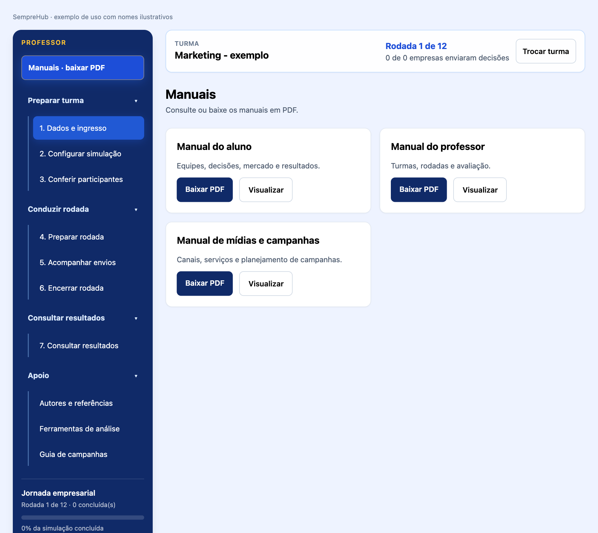

# SempreHub - Manual do professor

## Carta do Fundador

Prezado(a) Futuro(a) Empreendedor(a) e Líder Educacional,

Seja muito bem-vindo(a) ao SempreHub.

Quando idealizei e criei este simulador, o meu objetivo não era construir apenas mais uma plataforma digital de negócios ou um repositório de planilhas contábeis tradicionais. Eu queria criar uma ponte viva entre o conhecimento teórico e a realidade do mercado — um espaço onde você pudesse experimentar a adrenalina, os desafios e as conquistas de liderar uma organização de verdade.

O nome SempreHub carrega a essência da metodologia que preparei para a sua jornada. O 'Sempre' representa a constância, a resiliência e o aprendizado contínuo (Lifelong Learning). O 'Hub' define esta plataforma como um centro conector. Olhando para a nossa logomarca, você verá uma rede de pontos interconectados: eles são os departamentos da sua empresa (Marketing, Produção, Logística, P&D, RH e Finanças). Nenhuma decisão sua será isolada; cada escolha impactará toda a organização.

Aqui, o erro não é um ponto final, mas sim uma variável de aprendizado. Se o seu caixa ficar no vermelho ou se uma estratégia de marketing não der o retorno esperado nesta rodada, não desanime. Analise os relatórios reais, observe o movimento dos seus concorrentes em sala de aula e reajuste a sua operação no mês seguinte.

O mercado do SempreHub está aberto e o futuro do ecossistema está inteiramente em suas mãos.

**Prof. Guandalini**

Criador e Fundador do SempreHub — Simulador de Empreendedorismo

## A história e o conceito da logomarca SempreHub

**Autoria e criação: Professor Guandalini.** A marca, o nome e a identidade visual foram idealizados e criados pelo Professor Guandalini para unir o ambiente corporativo à conexão das redes modernas. O símbolo representa uma metodologia de aprendizado viva e integrada, voltada ao Ensino Médio e Superior.

**SEMPRE** evoca constância, aprendizado contínuo e resiliência: empreender exige tentativas, análise dos relatórios, ajustes e evolução. **HUB** representa um centro conector de inteligência, onde estudantes, mercado competitivo e gestão se encontram.

**A rede de decisões.** Os nós azuis e cianos representam os seis departamentos: P&D, Produção, Logística, Marketing, RH e Finanças. As linhas mostram que nenhuma decisão é isolada: mudar a Produção afeta a Logística e as Finanças. Os dois núcleos em Laranja Ouro representam a tomada de decisão do estudante e o Motor de Inteligência Artificial que impulsiona a dinâmica do mercado.

**Paleta oficial da identidade visual:** Azul Royal **#034AA6** e Azul Absoluto **#0762D9** transmitem credibilidade e robustez; Ciano/Turquesa **#0AADBF** representa dinamismo e modernidade; Laranja Ouro **#D9851E** destaca geração de valor, criatividade e atitude empreendedora; Cinza Soft **#F2F2F2** organiza um fundo limpo para a leitura.

O Azul Profundo **#0B2545** e o Ouro Fosco **#C5A059** permanecem documentados como paleta institucional anterior. A identidade visual atual segue os códigos oficiais apresentados pelo fundador.

## Operação docente e calendário

No menu lateral, abra **Encerrar rodada**. Escolha a data em **Data limite da rodada** e clique em **Salvar prazo**. O bloqueio ocorre às **23:59:59 de Brasília**, exclusivamente na data configurada para aquele mês. Antes desse instante, rascunhos e envios finais continuam permitidos. Sem prazo, o encerramento é manual.

O sistema encerra o mês automaticamente quando o prazo vence, inclusive se ninguém estiver conectado. O professor também pode usar **Forçar Fechamento Imediato da Rodada**, com confirmação. Rascunhos existentes são preservados e processados como fechamento automático; sem decisão, o motor mantém as escolhas recorrentes anteriores e zera ações pontuais. Esses casos não equivalem a entrega final voluntária da equipe.

O motor preserva os cálculos da simulação, atualiza caixa, estoque e participação e avança o mês uma única vez. No próximo mês, o líder volta a editar e o professor configura um novo prazo. O mecanismo de inteligência de mercado recebe os dados estruturados para preparar análises e relatórios; suas fontes e controles ficam no painel docente. Projeções são identificadas e dados ausentes não são apresentados como fatos confirmados.

## Navegação: escolha à esquerda, trabalhe à direita

O menu lateral é o ponto de partida. Suas categorias e submenus aparecem abertos inicialmente. Você pode recolher uma categoria para organizar a tela e abri-la novamente quando precisar. O submenu selecionado fica destacado, e o conteúdo aparece no painel à direita. Em telas estreitas, o menu permanece disponível acima do conteúdo e possui rolagem própria.

1. Localize no menu o assunto desejado.
2. Clique uma vez no submenu. Não é necessário abrir outra janela para tomar decisões.
3. Confira o título do painel à direita antes de alterar qualquer valor.
4. Ao terminar, salve o rascunho, avance ou envie conforme a etapa.
5. Para estudar, abra **Manuais - baixar PDF**. Use **Visualizar** para consultar ou **Baixar PDF** para guardar uma cópia.

Os campos de decisão mostram pendências, como **Falta tomar esta decisão** ou **Falta confirmar esta decisão**. Eles não substituem este manual. A confirmação de uma área significa que a equipe conferiu todos os seus campos, incluindo a decisão de manter em zero ações opcionais. Um aviso de campo vazio continua pendente mesmo depois de marcar a revisão. Os estados do menu referem-se à última versão salva; valores ainda não salvos precisam ser registrados.

Versão 3.0 - outubro de 2026

Guia para preparar turmas, acompanhar equipes, conduzir rodadas e avaliar a aprendizagem. As imagens de uso apresentam nomes ilustrativos.

## 1. Crie a turma e controle o ingresso

1. Entre com sua conta de professor e selecione **Criar turma**.
2. Defina um nome livre para a turma. Não existe padrão obrigatório: o aluno seleciona exatamente o nome que você cadastrar.
3. Escolha o modo de jogo, cenário, rodadas e parâmetros antes de criar empresas.
4. No painel, abra **Dados e ingresso** e marque **Disponível para ingresso dos alunos**.
5. Informe à sala o nome da turma. Não é necessário divulgar código de turma ou convite de equipe.

Você pode ocultar outras turmas ou liberar somente uma. A visibilidade controla novos ingressos; alunos já vinculados continuam acessando sua turma. O vínculo é único: outra matrícula depende de autorização do professor da turma de origem.

A quantidade de alunos não precisa ser informada. Eles se cadastram e entram por conta própria. O professor não cadastra participantes nas equipes como procedimento normal.

## 2. Formação por afinidade e distribuição dos alunos restantes

Os alunos veem colegas disponíveis e equipes existentes na turma. Escolhem seus grupos por afinidade, com **3 a 5 integrantes**. A empresa pode começar com menos integrantes durante a formação, mas precisa atingir o mínimo para escolher o líder e concluir uma rodada.

Depois de perguntar em sala se todos conseguiram entrar nas equipes:

1. Confira a lista **Alunos sem equipe** no painel de ingresso.
2. Se necessário, organize novas equipes para garantir vagas.
3. Clique em **Encerrar formação e distribuir alunos sem equipe**.
4. Confira a mensagem com os alunos e suas equipes de destino.

O programa distribui aleatoriamente os alunos já cadastrados naquela turma, usando somente vagas em equipes com pelo menos três integrantes. Nenhuma equipe ultrapassa cinco. Se o total de vagas for insuficiente, a operação é bloqueada sem distribuição parcial.

O encerramento impede novas entradas e criação de equipes. Antes de fechar a primeira rodada, você pode usar **Reabrir formação** para corrigir a organização. Depois do início das rodadas, essa reabertura não fica disponível.

### Exceções e troca de turma

Em **Autorizar troca de turma ou inclusão excepcional**, selecione o aluno e registre uma justificativa. A inclusão manual atende impedimentos alheios ao aluno e usa uma equipe com vaga da mesma turma. Alunos que já estão em uma equipe não são duplicados.

Para autorizar troca, escolha uma turma de destino disponível para ingresso. O aluno passa a poder selecionar esse destino; a autorização não o matricula automaticamente. A troca é consumida uma vez e preserva o histórico. Se o aluno for líder de uma equipe ativa, ele precisa transferir a liderança e aguardar a próxima rodada antes de trocar de turma. Sua saída pode deixar a equipe de origem abaixo do mínimo; confira a composição.

## 3. Liderança e permissões

A equipe escolhe o líder inicial depois de ter três a cinco integrantes. Cada aluno registra sua escolha. Quem recebe mais da metade das escolhas assume a liderança. Quem criou a empresa não é automaticamente líder nas novas equipes.

**O líder registra, salva e envia; os demais visualizam e contribuem na discussão.** Não há exigência de confirmação individual de cada integrante. As alterações e o responsável por cada envio ficam registrados.

O líder pode escolher outro integrante e clicar em **Transferir liderança para a próxima rodada**. A tela destaca o próximo líder e a rodada de vigência. A permissão não muda no mês atual: a transferência é efetivada somente depois do fechamento. Há uma transferência programada por rodada; não existe transferência para depois da última rodada.

Para manter a continuidade, equipes existentes antes desta versão mantêm seu responsável anterior como líder. Os registros de confirmações das versões anteriores também são preservados para consulta histórica.

## 4. Prepare mercado e acompanhe as decisões

Em **Preparar rodada**, defina setor, tipo de comércio e quantidades de notícias, análises e produtos. Revise a edição antes de publicá-la. Os alunos consultam o conteúdo disponível da turma e as condições de concorrência do simulador.

SWOT, Porter, PESTEL e concorrência usam pesquisa atual e informações registradas da empresa. O painel docente permite consultar diagnósticos, datas e fontes de pesquisa. Informações não confirmadas são indicadas como projeções com premissas; não devem ser apresentadas como fatos ocorridos.

A análise de concorrência cobre perfil, localização e alcance, porte e participação, portfólio, qualidade e diferenciais, preços, pagamento, promoções, canais, presença digital, atendimento e reputação. Quando não existe base suficiente para um concorrente real, o sistema pode usar um concorrente de referência explicitamente projetado.

O aluno não recebe decisões prontas. **BCG, segmentação e análise financeira são responsabilidade da equipe.** Os relatórios narrativos do painel docente não substituem a análise escrita dos alunos; na visão deles, o histórico financeiro reúne suas próprias análises e os demonstrativos calculados.

## 5. Envio final e fechamento da rodada

O aluno percorre produtos e marketing, ferramentas e segmentação, finanças, produção e logística quando aplicável. O líder pode guardar o trabalho em **Salvar rascunho** ou **Salvar e ir para a próxima etapa**.

**Rascunho não é entrega.** O envio final só ocorre quando todas as informações exigidas estiverem presentes. A mensagem de bloqueio indica as pendências.

O programa exige revisão das áreas aplicáveis, mixes completos, diretriz estratégica, segmentação, BCG de todos os produtos e análise financeira. Orçamentos de campanha são exigidos quando o serviço não possui custo público validado. Ações opcionais podem permanecer em zero.

1. Acompanhe **Envios** e as pendências de cada equipe.
2. Confira se todas as equipes têm entre três e cinco integrantes e líder definido.
3. Confira os envios finais. O fechamento automático ou forçado também processa registros pendentes conforme a regra de calendário.
4. Confirme o fechamento manual quando necessário; os eventos são sorteados pelo sistema.
5. Compare resultados e hipóteses com a turma antes da próxima rodada.

O fechamento calcula o mercado compartilhado, custos, produção e finanças; preserva os registros e avança o mês. Também efetiva as transferências de liderança previstas para a nova rodada. Depois do envio final, o líder não pode editar a decisão até o próximo mês.

## 6. BCG e consequências das escolhas

A matriz da Boston Consulting Group usa crescimento no eixo vertical e participação relativa no horizontal. Alta participação fica à esquerda: Estrela no alto à esquerda e Vaca leiteira embaixo; Interrogação no alto à direita e Abacaxi embaixo. O corte didático de crescimento é 10%, e o de participação é 1x. O eixo horizontal é logarítmico.

Os alunos informam crescimento, participação, classificação e base dos dados. Projeções exigem premissas. A participação relativa é a participação do produto dividida pela participação do maior concorrente. Marcadores numerados identificam produtos; não indicam faturamento.

Interpretações se traduzem em escolhas de preço, posicionamento, público, produção e investimento. Coerência estruturada entre SWOT, BCG, segmentação e mix pode afetar a conversão comercial. Outros efeitos são econômicos: excesso de estoque imobiliza caixa, crédito gera juros, expansão aumenta capacidade e custos, e P&D afeta qualidade. O sistema não pune textos livres arbitrariamente nem garante lucro por uma classificação correta.

## 7. Máquinas, crédito e demonstrativos

A vida útil contábil padrão de máquinas é **24 meses**, configurável antes da entrada das empresas. O aluno consulta o valor vigente na Produção e a condição de cada máquina no painel operacional. Depreciação reduz o valor contábil; a máquina não é removida automaticamente ao fim da depreciação.

Novas compras são opcionais a partir do mês 3, com pagamento no mês da compra e ativação na rodada seguinte. Funcionários, horas extras, insumos e máquinas impõem limites conjuntos à capacidade. Horas extras usam a premissa didática de até 40 horas por funcionário, adicional de 50%, salário/220 e encargos.

A DRE mostra resultado, a DFC mostra dinheiro, e o balanço mostra ativos e obrigações. A análise escrita deve discutir margem, caixa, recebimentos, pagamentos, estoques e capital de giro. Solicitar crédito exibe aviso de custo alto e risco ao lucro e caixa. Em Startup, aporte de investidores não entra como receita comercial e pode diluir os fundadores.

## 8. Avaliação automática e auditoria

O relatório pedagógico calcula **nota de desempenho de 0 a 10** a partir da pontuação ponderada do simulador. Ela é provisória enquanto houver rodadas e final ao encerrar a simulação. Os critérios incluem lucro, patrimônio, satisfação quando disponível e entrega das decisões; critérios sem dados têm pesos redistribuídos.

No novo fluxo de equipes, um envio válido pelo líder comprova a entrega da equipe. Os demais alunos não perdem pontuação por não confirmar individualmente. Acessar o sistema comprova acesso, não aprendizagem ou contribuição efetiva; use a discussão e a justificativa das decisões para sua devolutiva pedagógica.

Consulte resultados, demonstrativos, histórico de liderança, decisões e diagnósticos por empresa e rodada. Exporte os relatórios quando precisar registrar a avaliação. A decisão de incorporar essa nota à avaliação formal da disciplina continua sob responsabilidade do professor.

## 9. Primeiro uso do professor, passo a passo

1. Crie ou acesse sua conta de professor e abra sua turma.
2. Em **Dados e ingresso**, confira o nome livre da turma e a disponibilidade para ingresso. Informe aos alunos o nome que aparece na tela. Não há necessidade de informar a quantidade de alunos nem distribuir códigos como procedimento normal.
3. Em **Configurar simulação**, escolha modelo e parâmetros antes de criar empresas. Confira caixa, rodadas, salário, crédito, concorrência e condições do modelo. Registre as premissas didáticas que explicará em sala.
4. Em **Conferir participantes**, acompanhe inscrições, grupos e líder escolhido. Pergunte se todos conseguiram entrar. Use a distribuição de alunos sem equipe apenas quando existirem vagas em equipes com pelo menos três integrantes.
5. Em **Preparar rodada**, escolha o setor e prepare o conteúdo. Revise dados, produtos, custos e projeções antes de publicar. Sem edição publicada, o aluno não consegue completar o catálogo correspondente.
6. Em **Acompanhar envios**, confira as entregas finais. Um rascunho não comprova entrega. Uma equipe sem líder ou abaixo do mínimo precisa de organização antes de fechar a rodada.
7. Em **Encerrar rodada**, confira pendências, confirme o fechamento e acompanhe os resultados à direita. Essa ação calcula o mês e pode efetivar transferências de liderança.
8. Em **Consultar resultados**, compare empresas, demonstrativos e avaliação. Em **Manuais - baixar PDF**, consulte todos os materiais ou indique aos alunos o capítulo adequado.

## 10. Roteiro para orientar principiantes

Apresente a navegação antes de discutir estratégia. Demonstre uma decisão com dados ilustrativos: localizar o submenu, interpretar a informação, escolher um valor, salvar rascunho, confirmar a área e enviar. Explique a diferença entre uma decisão opcional em zero e uma etapa ainda não conferida.

Os avisos junto aos campos indicam pendências, e não dão a solução nem explicam o conceito. A fundamentação fica nos manuais. Oriente o aluno a localizar o assunto no sumário e pedir ajuda quando não compreender o dado. O manual do aluno apresenta exemplos de preço, BCG, crédito, produção e análise financeira.

Um início possível é perguntar: quem é o público; o que será oferecido; por que compraria; quanto a equipe pretende vender; qual capacidade consegue atender; e quanto dinheiro será necessário antes de receber as vendas. Essas perguntas organizam a discussão sem substituir as decisões.

## 11. Checklist antes de cada fechamento

- A edição de mercado está publicada e foi conferida.
- As equipes possuem composição válida e líder definido.
- Os alunos que ficaram sem equipe foram atendidos sem ultrapassar cinco integrantes.
- As decisões estão enviadas, não apenas salvas como rascunho.
- As etapas aplicáveis, mixes, BCG, segmentação e análise financeira foram registradas.
- A turma conhece as consequências de crédito, produção, pessoas e campanhas.
- Transferências de liderança têm vigência clara na próxima rodada.

Se houver bloqueio, identifique a equipe e a pendência e peça a correção. O fechamento forçado ou automático processa rascunhos preservando seus valores, mas identifica esses registros como automáticos. Oriente a entrega final para evitar que escolhas ainda incompletas afetem o negócio. Uma alteração excepcional de participante exige justificativa e registro.

## 12. Interpretação de relatórios e nota

Use a DRE para discutir resultado, a DFC para discutir dinheiro e o balanço para discutir a posição financeira. Receita alta com caixa pressionado pode sinalizar prazos, estoque, custos ou investimento. Compare tendências entre rodadas; um resultado isolado não explica sozinho toda a aprendizagem.

A nota automática de zero a dez resume critérios de desempenho definidos pelo simulador. Confira os critérios e pesos efetivamente exibidos no relatório pedagógico; não atribua uma regra diferente por suposição. A entrega pelo líder conta para a equipe. Histórico de acesso não prova contribuição intelectual.

**Exemplo de devolutiva:** peça à equipe que explique por que tomou crédito e por que aumentou a produção. Compare justificativa, custo de juros, capacidade e vendas realizadas. Discuta uma alternativa para a rodada seguinte sem preencher a decisão por eles.

Use pesquisa atual, fontes e premissas para revisar os diagnósticos. Um dado confirmado, uma interpretação e uma projeção têm naturezas diferentes. A ausência de fonte não autoriza tratar uma estimativa como fato. A análise financeira e a segmentação continuam responsabilidade dos alunos.

## 13. Problemas frequentes e respostas de orientação

**Aluno não vê a turma:** confira disponibilidade, rodada de ingresso, encerramento da formação e vínculo anterior. **Aluno não edita:** confira o líder vigente. **Transferência não ocorreu:** veja a próxima rodada indicada; agendar não muda a permissão atual. **Envio bloqueado:** consulte a pendência específica. **Sem vagas para distribuição:** organize vagas antes de repetir; não force equipes acima do limite.

Se o aluno mudou de turma com autorização, confira a composição da origem. Se a tela mostra versão antiga, peça atualização da página. Se os parâmetros não podem ser alterados, confira a etapa e as empresas já criadas; não prometa mudança retroativa de resultados.

Para retomar uma aula, abra o menu lateral, confira a rodada e use a última versão registrada. Consulte o histórico antes de corrigir uma situação: quem enviou, qual versão, qual rodada e qual justificativa de alteração.
