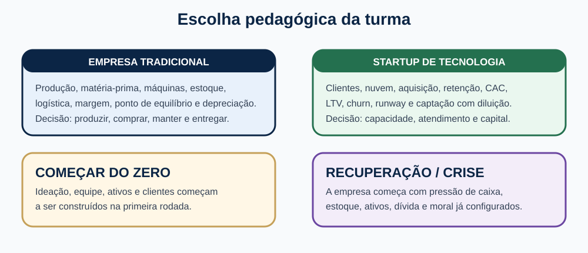
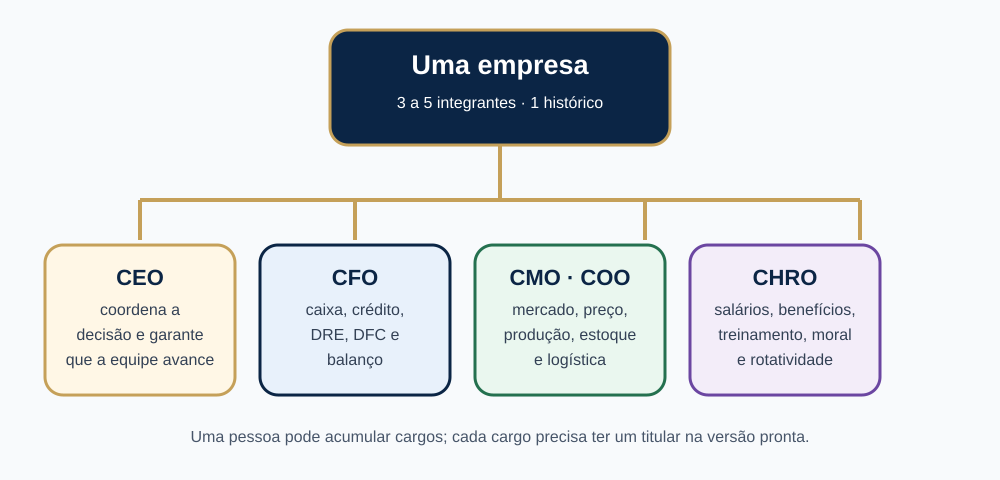
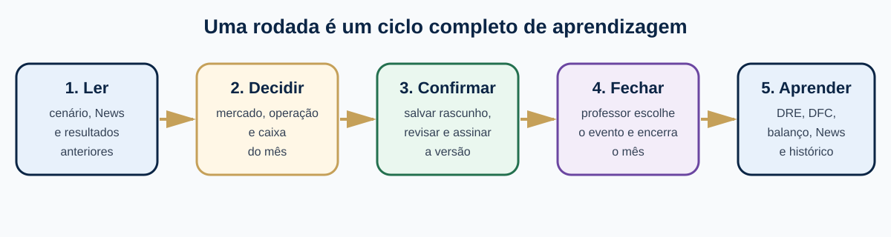
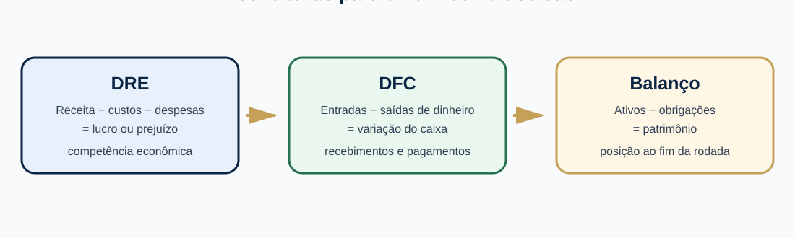

# Manual do professor

Guia de condução do simulador de empreendedorismo: preparação, acompanhamento das equipes, fechamento das rodadas e devolutiva pedagógica.

## 1. Preparar a turma

1. Acesse o SempreHub, crie sua conta como professor e informe o código docente da instituição.
2. Em **Minhas turmas**, selecione **Criar turma** e dê um nome à atividade.
3. Defina o número de rodadas. Cada rodada representa um mês; os resultados anteriores permanecem no histórico.
4. Escolha participação individual ou **Equipes de 3 a 5 alunos**.
5. Escolha o modo **Empresa tradicional**, **Startup** ou mantenha a configuração da turma existente. Defina cenário e parâmetros antes da entrada das empresas.
6. Divulgue o código de seis caracteres. Em equipes, um aluno abre a empresa e os demais usam o convite da empresa.

O modo, cenário e configuração operacional ficam definidos após a entrada da primeira empresa. O número total de rodadas pode ser ajustado respeitando os períodos já concluídos.

## 2. Organizar equipes e responsabilidades

O fundador assume CEO e distribui CFO (finanças), CMO (marketing), COO (operações) e CHRO (pessoas). Um aluno pode acumular cargos. Oriente a revisão conjunta antes de salvar: todos os integrantes precisam confirmar a mesma versão. Alterações na decisão exigem novas confirmações. O painel da turma informa as pendências.

## 3. Conduzir cada rodada

1. Abra a turma e confira a rodada atual e o número de decisões prontas.
2. Peça às equipes que leiam o **SempreHub News**, consultem a biblioteca e registrem suas hipóteses.
3. Acompanhe as empresas e as pendências de equipes. O fechamento só é permitido quando as confirmações necessárias estiverem concluídas.
4. Na área **Fechar rodada**, escolha um evento ou permita o sorteio.
5. Feche uma rodada por vez. O sistema registra decisões, resultados e eventos e avança o estado da empresa.
6. Oriente a comparação entre expectativa e resultado antes da próxima decisão.

No jogo individual, a ausência de decisão pode repetir automaticamente escolhas anteriores com as restrições previstas pelo motor. Confirme o histórico para distinguir entregas do aluno e decisões automáticas. O evento é escolhido ou sorteado no fechamento: a edição correspondente do jornal passa a estar disponível após o processamento.

## 4. Ler os resultados

| Documento | Pergunta pedagógica |
| --- | --- |
| DRE | A operação gerou lucro após custos, despesas e tributos? |
| DFC | Quais recebimentos e pagamentos explicam a variação de caixa? |
| Balanço | Como se distribuem ativos, obrigações e patrimônio? |
| Histórico | Como as decisões de uma rodada influenciaram os períodos seguintes? |

No modo tradicional, conecte produção, matéria-prima, máquinas, manutenção, estoques, logística e pessoas. Em Startup, interprete aquisição e retenção de clientes, capacidade de nuvem, CAC, LTV, churn, runway e diluição por aporte. Demonstrativos que não foram registrados no modo legado aparecem como indisponíveis.

## 5. Primeira devolutiva e avaliação

O painel da empresa disponibiliza automaticamente o **Relatório da primeira rodada** após o fechamento. Ele inclui resultado, evento, participação, perguntas de reflexão e catálogo de mídias com conceito, finalidade, custos ilustrativos e prazos. A fotografia da rodada permanece disponível ao longo da atividade.

1. Peça a cada equipe para explicar a relação entre preço, investimentos, capacidade e vendas.
2. Compare lucro e caixa, destacando prazos, estoques, compras e financiamento.
3. Discuta uma hipótese que funcionou e outra que deverá ser revisada.
4. Use o relatório pedagógico da turma e o histórico para acompanhar evolução, decisões e participação.
5. Exporte os registros em CSV quando necessário. Indicadores e ranking apoiam a discussão; a nota institucional depende dos critérios da disciplina.

## 6. Biblioteca e fontes

A aba **Autores e referências** informa obras e capítulos ou seções relevantes. Confira a edição adotada pela instituição. Porter orienta as cinco forças; Fahey e Narayanan apoiam a leitura do macroambiente; Kotler e Keller tratam de mercado, segmentação e marketing; Gitman e Zutter orientam finanças; Dornelas e GEM apoiam a discussão do empreendedorismo.

PESTEL examina fatores políticos, econômicos, sociais, tecnológicos, ecológicos e legais. Porter examina rivalidade, entrantes, fornecedores, clientes e substitutos. Use ambas para formular oportunidades e ameaças da SWOT e confronte forças e fraquezas com os indicadores da empresa.

## 7. Mídias e planejamento financeiro

O catálogo inclui digital, televisão, rádio, imprensa, mídia exterior, áudio, cinema, influência, panfletagem e PDV. Cada item explica finalidade, unidade de compra, faixa de custo, pagamento e efeito no caixa. Não determina qual canal a equipe deve escolher. As faixas são referências do exercício, sujeitas a cotação e contrato.

Discuta investimentos em tráfego pago, conteúdo, SEO, e-mail/CRM, identidade visual, eventos e parcerias. Percentuais de faturamento podem ser hipóteses iniciais, mas devem ser confrontados com objetivos, margem e disponibilidade de caixa. IOF de 3,5% é uma hipótese didática para operação internacional, cuja incidência deve ser conferida. Retenções e prazos dependem da operação, legislação e contrato.

## 8. Apoio aos alunos

Em **Alunos de teste**, crie contas para demonstração quando necessário. Use a função de redefinição de senha para alunos de suas turmas. A recuperação por e-mail depende do envio configurado no sistema. Oriente os alunos a consultar o manual separado e a reabrir a orientação inicial. O tour pode ser ocultado com **Não mostrar novamente**; a escolha fica no navegador do usuário.

Antes de encerrar a atividade, faça a devolutiva final com evidências de várias rodadas, evitando avaliar apenas a posição no ranking.
